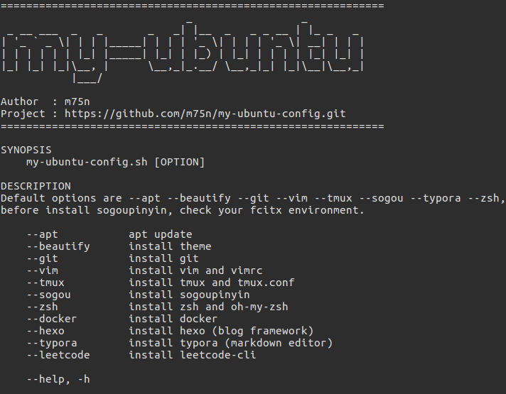

# my-ubuntu-config



自用 Ubuntu 装机脚本，便捷安装常用软件与系统美化

使用方法见帮助命令
```
./my-ubuntu-config.sh --help
```

PS:
- 注意修改 gitconfig 中的用户名与邮箱
- Flatabulous 主题与 Numix-circle 图标需要手动在 unity-tweak-tool 中启用
- vim 插件需要打开 vim 执行 `:PlugInstall` 安装
- 自动安装完 oh-my-zsh 后会进入 zsh 环境中，需要手动输入 `exit` 退出来继续脚本执行
